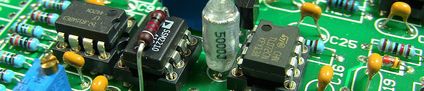
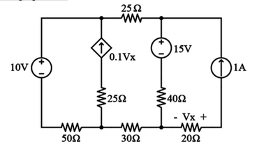
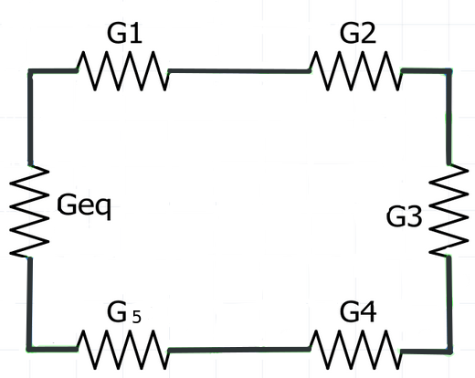

```{r setup, include=FALSE}
knitr::opts_chunk$set(echo = FALSE)
library(learnr)
```


<center>

<!-- {width="60%"} -->



</center>
  
  


## Parte 1 - Fundamentos


```{r preliminares}
quiz(
  question("En términos eléctricos, un material conductor es:",
    answer("un elemento que se oxida fácilmente en presencia de Oxígeno."),
    answer("un material que permite la circulación libre de los electrones.", correct = TRUE),
    answer("la capacidad de transportar energía."),
    answer("el que tiene alta resistencia al paso de la corriente."),
    random_answer_order = TRUE,
    allow_retry = TRUE
  ),
  question_radio(
  "¿Un campo eléctrico puede generar movimiento aleatorio sobre una carga positiva o negativa?",
  answer("Sí", correct = TRUE),
  answer("No")
),
  question("En electricidad, los materiales que **no** permiten el paso de la corriente eléctrica, se conocen como:",
    answer("aislantes", correct = TRUE),
    answer("superconductores"),
    answer("flotadores"),
    answer("opresores"),
    random_answer_order = TRUE,
    allow_retry = TRUE
  ),
question_checkbox(
  "Algunos de estos conceptos conforman una red eléctrica",
  answer("Generación", correct = TRUE),
  answer("Línea de Transmisión", correct = TRUE),
  answer("Transformadores", correct = TRUE),
  answer("Distribución", correct = TRUE),
  answer("Equipotenciales", message = "Incorrecto"),
  answer("Ancla", message = "Las opciones correctas son : Generación, Transformadores, Línea de Transmisión, Distribución"),
  answer("Peralte", message = "No es una opción correcta."),
  random_answer_order = TRUE,
  allow_retry = TRUE
  ),
question("Tiene como unidades de medida $Joule/Coulomb$ :",
         answer("El voltaje", correct = TRUE),
         answer("La corriente"),
         answer("Una carga eléctrica"),
         answer("La masa por la velocidad"),
         random_answer_order = TRUE,
         allow_retry = TRUE),
question("Al voltaje también se le conoce como:",
         answer("Diferencia de potencial", correct = TRUE),
         answer("Tensión", correct = TRUE),
         answer("Corto circuito"),
         answer("Electrolito"),
         answer("Amplificador operacional"),
         random_answer_order = TRUE,
         allow_retry = TRUE),
question_text(
  "Escriba en la casilla de abajo y de manera correcta, ¿Cuál es la unidad de medida para la corriente?",
  answer("ampere", message = "No olvides poner mayúscula al inicio"),
  answer("Ampére", message = "Las tildes són importantes, pero no es el caso."),
  answer("Amperre", message = "Verifica tu respuesta"),
  answer("Ampere", correct = TRUE, message = "!Perfecto!"),
  allow_retry = TRUE,
  placeholder = "Escribe acá tu respuesta"
),
question("Las condiciones para que se genere una corriente eléctrica en un circuito, són:",
         answer("Presencia de una fuente de voltaje y una trayectoria cerrada por un conductor.", correc = TRUE),
         answer("Activación de un generador radioactivo y una resistencia de 1 $\\Omega$."),
         answer("Tener un led y un conductor eléctrico conectados en serie."),
         answer("Que exista una cantidad de masa proporcional al campo eléctrico y aplicarle una fuerza."),
         random_answer_order = TRUE,
         allow_retry = TRUE
         ),
question("¿Qué es la corriente eléctrica?",
         answer("La corriente eléctrica es el flujo de carga eléctrica que recorre un material.", correct = TRUE),
         answer("La cantidad de electrones de valencia de un elemento."),
         answer("Són los elementos que cumplen con la ley del octeto."),
         answer("Es la oposición al flujo de electrones que se presenta en un material."),
         random_answer_order = TRUE,
         allow_retry = TRUE)
)

```


```{r pregunta_rank, echo=FALSE}
library(sortable)
# Define the answer options
unidades <- c(
    "MA",
    "KA",
    "A",
    "mA",
    "pA"
    
  )

# Initialize the question
question_rank(
  "Ordene de mayor a menor las siguientes unidades:",
  answer(unidades, correct = TRUE),
  answer(rev(unidades), correct = FALSE, message = "¡En orden inverso!"),
  allow_retry = TRUE
)
```


## Parte 2 - Componentes de un circuito / Ley de Ohm

  

Pregunta 1

<center>

</center>  


```{r depen}
question("De la imagen anterior es correcto afirmar que:",
         answer("Representa dos fuentes independientes", message = "Eso no es correcto."),
         answer("Hay una fuente de voltaje dependiente representada de dos formas diferentes"),
         answer("Es la representación de una fuente de corriente dependiente, representada de dos formas diferentes", message = "Recuerda que la flecha representa la dirección de una corriente."),
         answer("Representa una fuente de corriente y una fuente de voltaje, dependientes.", correct = TRUE),
         answer("El gráfico de la izquierda representa una fuente de corriente dependiente, que depende de un valor $V_{x}$" , correct = TRUE),
         answer("El gráfico de la derecha representa una fuente de voltaje dependiente, que depende de un valor $V_{x}$" , correct = TRUE),
         random_answer_order = TRUE,
         allow_retry = TRUE
)
```


> Responda las preguntas 2, 3, 4 y 5 con la información de la siguiente imagen.

<center>

</center>

Pregunta 2

```{r circuito}
question("De la imagen anterior es posible inferir que:",
         answer("Representa un circuito conectado en serie que tiene 3 nodos.", message = "Eso no es correcto."),
         answer("Hay una fuente de voltaje dependiente."),
         answer("Es un circuito energizado con dos fuentes de corriente dependientes."),
         answer("Hay dos fuentes de voltaje independientes.", correct = TRUE),
         answer("Hay una fuente de corriente dependiente, que depende de un valor v $\v_{x}$" , correct = TRUE),
         answer("La fuente de corriente independiente es de 1A." , correct = TRUE),
         answer("V $\v_{x}$ = (-1A)*(20 $\\Omega$)", correct = TRUE),
         random_answer_order = TRUE,
         allow_retry = TRUE
)
```


Pregunta 3

```{r circuito1}
question_radio("De la imagen del circuito, podemos decir que el valor para la fuente dependiente de corriente es $-2A$:",
               answer("Sí", correct = TRUE),
               answer("No"))
```

Pregunta 4

```{r circuito2}
question_radio("El número de nodos de derivación que tiene el circuito de la imagen es 4:",
               answer("Sí", correct = TRUE),
               answer("No"))
```

Pregunta 5

```{r circuito3}
question_radio("De la imagen podemos decir que la polaridad en la resistencia de $20\\Omega$ representa una caída de la tensión en la resistencia generada por el paso de la corriente con magnitud $1A$:",
               answer("Sí", correct = TRUE),
               answer("No"))
```
  
  
  

> Responda las preguntas 6 y 7 con la información de la siguiente imagen.

<center>

</center>  
  
  


Pregunta 6

Modifique el código para obtener la resistencia equivalente `requiv` en Ohms para el circuito de la imagen.

```{r requiv, exercise=TRUE, exercise.cap="Resistencia equivalente", exercise.eval=TRUE, exercise.completion=TRUE}
r1 <- 220
r2 <- 62
r3 <- 330
r4 <- 
r5 <- 
requiv <- r1+r2+r3
```

```{r requiv-hint-1}
r1 <- 220
r2 <- 62
r3 <- 330
r4 <- r4*10^3
r5 <- r5*10^3
requiv <- r1+r2+r3...
```

```{r requiv-hint-2}
r1 <- 220
r2 <- 62
r3 <- 330
r4 <- r4*10^3
r5 <- r5*10^3
requiv <- r1+r2+r3+r4...
```

```{r requiv-solution, exercise.reveal_solution = FALSE}
r1 <- 220
r2 <- 62
r3 <- 330
r4 <- 1*10^3
r5 <- 3.3*10^3
requiv <- r1+r2+r3+r4+r5
```

```{r requivalente}
question("La resistencia equivalente del circuito es:",
  answer("$4912$ $ohms$", correct = TRUE),
  answer("$616.3$ $ohms$"),
  answer("$612$ $Kohms$"),
  answer("No es posible calcular la resistencia equivalente."),
  random_answer_order = TRUE,
         allow_retry = TRUE
  
)
```

  
Pregunta 7

Cacule la corriente `iser` que pasa por la resistencia equivalente del circuito de la imagen. Haga uso de la consola de R para modificar el código y obtener la respuesta.


```{r iserie, exercise=TRUE, exercise.setup = "requiv-solution", exercise.cap ="Corriente iser", exercise.eval=TRUE, exercise.completion=TRUE}

#V1 <- iser*requiv
```

<div id="iserie-hint">
**Pista:** La ley de Ohm para la corriente está definida como I = V/R.
</div>


```{r vequiv}
question("La corriente del circuito equivalente es:",
  answer("$2.442997*10^{-3}$ $A$", correct = TRUE),
  answer("$0.29054$ $A$"),
  answer("$2442.997$ $MA$"),
  answer("No es posible calcular la corriente equivalente."),
  random_answer_order = TRUE,
         allow_retry = TRUE
  
)
```


> Responda las siguientes preguntas basados en la siguiente  imagen:

<center>

</center>

Pregunta 8

```{r rlc}
question("De la imagen anterior se evidencia que:",
         answer("El capacitor 2 se encuentra conectado en paralelo con $R$ y con $I_s$.", correct = TRUE),
         answer("Hay dos capacitores en el circuito.", correct = TRUE),
         answer("El inductor se encuentra conectado en paralelo con la fuente de voltaje independiente y la resistencia."),
         answer("El inductor se puede sumar con la fuente de voltaje para obetener una conductancia equivalente."),
         random_answer_order = TRUE,
         allow_retry = TRUE
         )

```

Pregunta 9

```{r dccircuit}
question("Sabiendo que el circuito esta energizado con una fuente de voltaje DC, es posible afirmar:",
  answer("Que la corriente que pasa a través de la capacitancia 1 es cero.", correct = TRUE),
  answer("Que el voltaje en la inductancia es cero.", correct = TRUE),
  answer("Que la suma de la corriente que pasa por la fuente de voltaje y el capacitor 2 es igual a la corriente de la fuente de corriente."),
  answer("Que el circuito equivalente es un circuito conectado en serie, entre la fuente de voltaje, la fuente de corriente y la resistencia", correct = TRUE),
  answer("Que el circuito equivalente tiene 3 nodos de derivación"),
  random_answer_order = TRUE,
         allow_retry = TRUE
  )
```


Pregunta 10

Escoja las afirmaciones que correspondan a la definición.

```{r conductancia}
question("Acerca de la conductancia eléctrica podemos afirmar lo siguiente:",
         answer("Es la capacidad que tiene un material para dejar pasar la corriente eléctrica.", correct = TRUE),
         answer("Es la propiedad inversa de la resistencia.", correct = TRUE),
         answer("Su unidad de medida son los siemens ó mohs.", correct = TRUE),
         answer("Se denota por la letra $G$.", correct = TRUE),
         answer("Debido a que es el inverso de la resistencia se puede definir como, $\\frac{1}{R}$ donde $R$ es la resistencia del circuito."))
```
  
  
  
> Responda las siguientes preguntas respecto de la imagen a continuación:  

<center>

</center>  

   
   
Pregunta 11

Modifique el código para calcular la resistencia equivalente entre R2=20$\Omega$, R3=15$\Omega$, R4=10$\Omega$.

```{r rparal, exercise = TRUE, exercise.cap ="Resistencia Equivalente", exercise.eval=FALSE, exercise.completion=TRUE}
r4 <- 
r2 <-
r3 <-
rparal <- 1/((1/r3)+)
```

```{r rparal-hint}
r4 <- 
r2 <-
r3 <-
rparal <- 1/((1/r2)+(1/r3)+(1/r4))
```


```{r paralelo}
question("El valor de la resistencia equivalente para $R2$, $R3$ y $R4$ es:",
         answer("$4.615385\\Omega$", correct = TRUE),
         answer("$8.571429\\Omega$"),
         answer("$45\\Omega$"),
         answer("$22.615385\\Omega$"),
         random_answer_order = TRUE,
         allow_retry = TRUE
         )
```


Pregunta 12

Use el código para calcular la **Resistencia Equivalente Total** del circuito, de la imagen.  


```{r rtotal, exercise=TRUE, exercise.setup="rparal", exercise.cap ="Resistencia Equivalente Total", exercise.eval=FALSE, exercise.completion=TRUE}
reqtot <- rparal+R1
```


```{r equivparal}
question("El valor de la Resistencia Equivalente Total es:", 
         answer("$22.6153\\Omega$", correct = TRUE),
         answer("$4.615385\\Omega$"),
         answer("$63\\Omega$"),
         answer("$3.615385\\Omega$"),
         allow_retry = TRUE,
         random_answer_order = TRUE)
```


Pregunta 13




```{r conductserie}
question("Una expresión para obtener la conductancia equivalente $Geq$, de la imagen anterior es:",
         answer("$G_{eq}=\\frac{1}{\\frac{1}{G1}+\\frac{1}{G2}+\\frac{1}{G3}+\\frac{1}{G4}+\\frac{1}{G5}}$", correct = TRUE),
         answer("$G_{eq}=\\frac{1}{G1}+\\frac{1}{G2}+\\frac{1}{G3}+\\frac{1}{G4}+\\frac{1}{G5}$"),
         answer("$R_{eq}=\\frac{G_{eq}}{G1+G2+G3+G4+G5}$"),
         answer("$G_{eq}=\\frac{1}{1+R_{eq}}$"),
         random_answer_order = TRUE,
         allow_retry = TRUE
         )
```


Pregunta 14

```{r seriecir}
question("Un circuito conectado en serie se caracteriza,",
        answer("por poseer sólo nodos simples", correct = TRUE),
        answer("porque el valor de la corriente es la misma en cualquier punto.", correct = TRUE),
        answer("porque existe una única trayectoria para el paso de la corriente.", correct = TRUE),
        answer("porque el voltaje en cada resistencia es el mismo, independiente del valor de la resistencia."),
        answer("porque posee tantos nodos de derivación como resistencias tenga el circuito."),
        answer("porque la suma de los voltajes de los elementos pasivos es igual a la suma de las fuentes.", correct = TRUE),
        random_answer_order = TRUE,
        allow_retry = TRUE
        )
```

